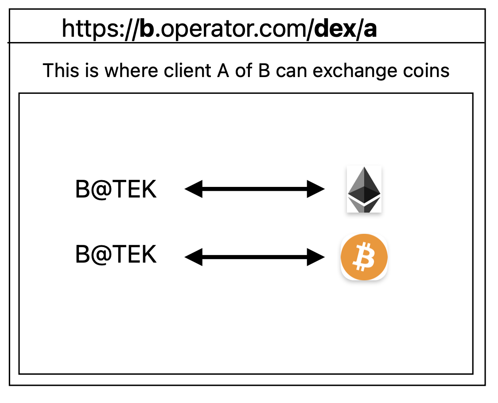

# https://teoseptoskratia.com

## Requirements

JDK 1.8

## Usage

You should `lein npm install` before doing anything to ensure you get the `source-map-support` library.

To build the clojurescript into a node script, use `lein build && lein resource`.

To then run the node app use `node build/server/main.js`.

You can add clojure and clojurescript dependencies in the normal `:dependency` spot.
You can also add `npm` dependencies in the `:npm {:dependency []}` spot.

