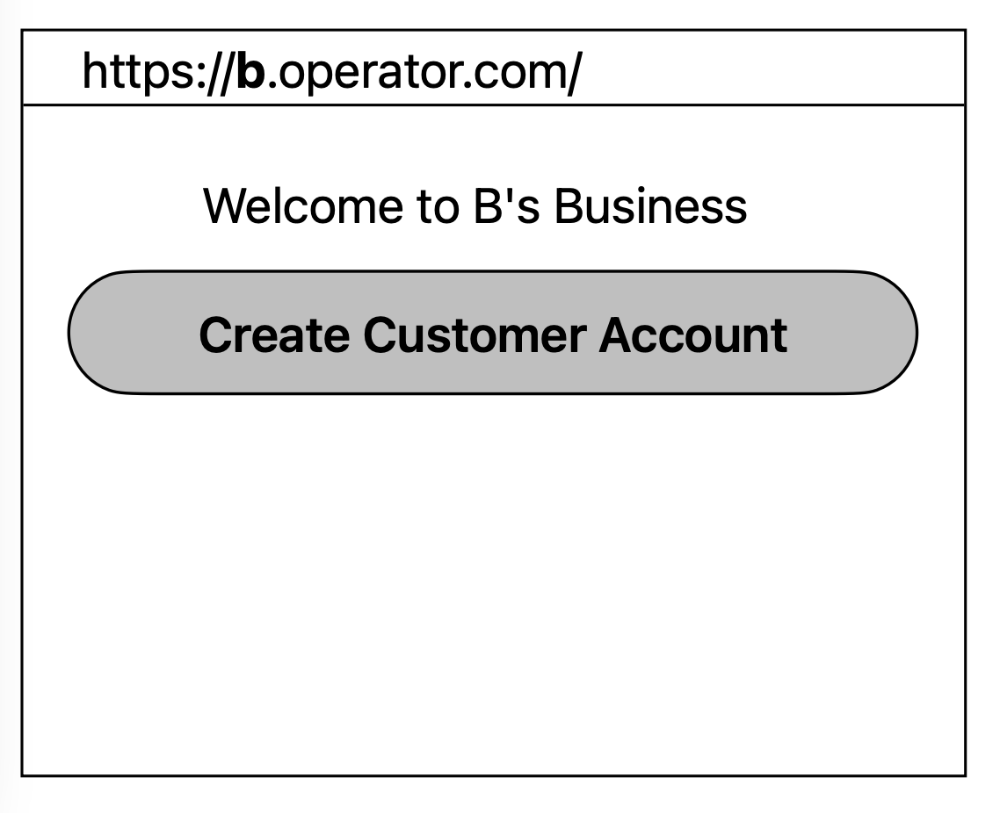

# https://teoseptoskratia.com

## Usage

You should `lein npm install` before doing anything to ensure you get the `source-map-support` library.

To build the clojurescript into a node script, use `lein build` (aliased to `lein cljsbuild once main`).
To then run the node app use `node build/main.js`.

You can add clojure and clojurescript dependencies in the normal `:dependency` spot.
You can also add `npm` dependencies in the `:npm {:dependency []}` spot.

## Testing

To test once, use `lein test` (which is aliased to `lein doo node test-node once`).
To watch code for changes and re-test, use `lein test-auto`.

## Distribution

You can distribute your app via npm by doing the following:

- Uncomment the line `["npm" "publish"]` in the `:release-tasks` section of `project.clj`
- Edit `:npm {:package {...}}` in `project.clj` as you would your `package.json` file. See npm docs for details. (If you want to distribute a public library, use `:private false`.

To create a build for release, simply call `lein release`.
This calls `lein do clean, build`, tags the commit, and deploys a build to either/both a maven repo and/or npm.

